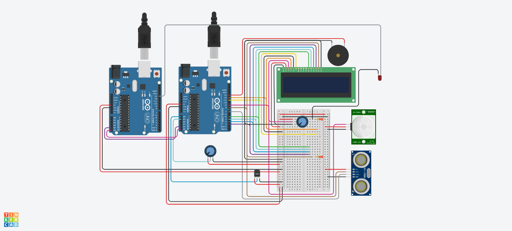

# ArduinoSmartHome
Link: https://www.tinkercad.com/things/ha34fb4U6DA

<table>
	<tr>
		<th>Name</th>
		<th>Quantity</th>
		<th>Component</th>
	</tr>
	<tr>
		<td>U2 U3</td>
		<td>2</td>
		<td>Arduino Uno R3</td>
	</tr>
	<tr>
		<td>U4</td>
		<td>1</td>
		<td>LCD 16 x 2</td>
	</tr>
	<tr>
		<td>R2 R1</td>
		<td>2</td>
		<td>220 Ω Resistor</td>
	</tr>
	<tr>
		<td>DIST2</td>
		<td>1</td>
		<td>Ultrasonic Distance Sensor</td>
	</tr>
	<tr>
		<td>PIR1</td>
		<td>1</td>
		<td>PIR Sensor</td>
	</tr>
	<tr>
		<td>U1</td>
		<td>1</td>
		<td>Temperature Sensor [TMP36]</td>
	</tr>
	<tr>
		<td>Rpot1 Rpot2</td>
		<td>2</td>
		<td>250 kΩ, Potentiometer</td>
	</tr>
	<tr>
		<td>PIEZO1</td>
		<td>1</td>
		<td>Piezo</td>
	</tr>
	<tr>
		<td>D1</td>
		<td>1</td>
		<td>Red LED</td>
	</tr>
</table>

## Notes:
* Connect the brown cable connected to breadboard near ultrasonic distance sensor to ultrasonic distance sensor trigger pin
* Connect the grey cable connected to breadboard near ultrasonic distance sensor to ultrasonic distance sensor echo pin